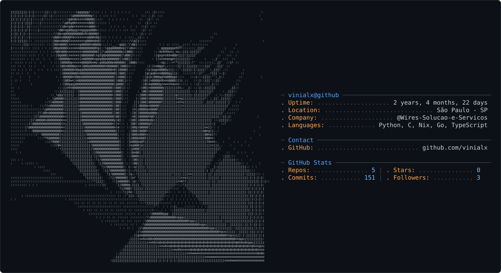

<picture>
  <source media="(prefers-color-scheme: dark)" srcset="assets/dark_mode.svg" />
  <source media="(prefers-color-scheme: light)" srcset="assets/light_mode.svg" />
  
</picture>

<h1 align="center"><code>hi, i'm vinicius</code></h1>
<h3 align="center"><code>developer · exploring new stacks and projects</code></h3>

  

  

---

### `📊 stats`

---

### `stack`

 
<!-- skillicons.dev doesn't have an MSSQL icon, so it stays as a badge -->

---

### `currently learning`

---

### `want to learn`

---

### `interests`

---

  

