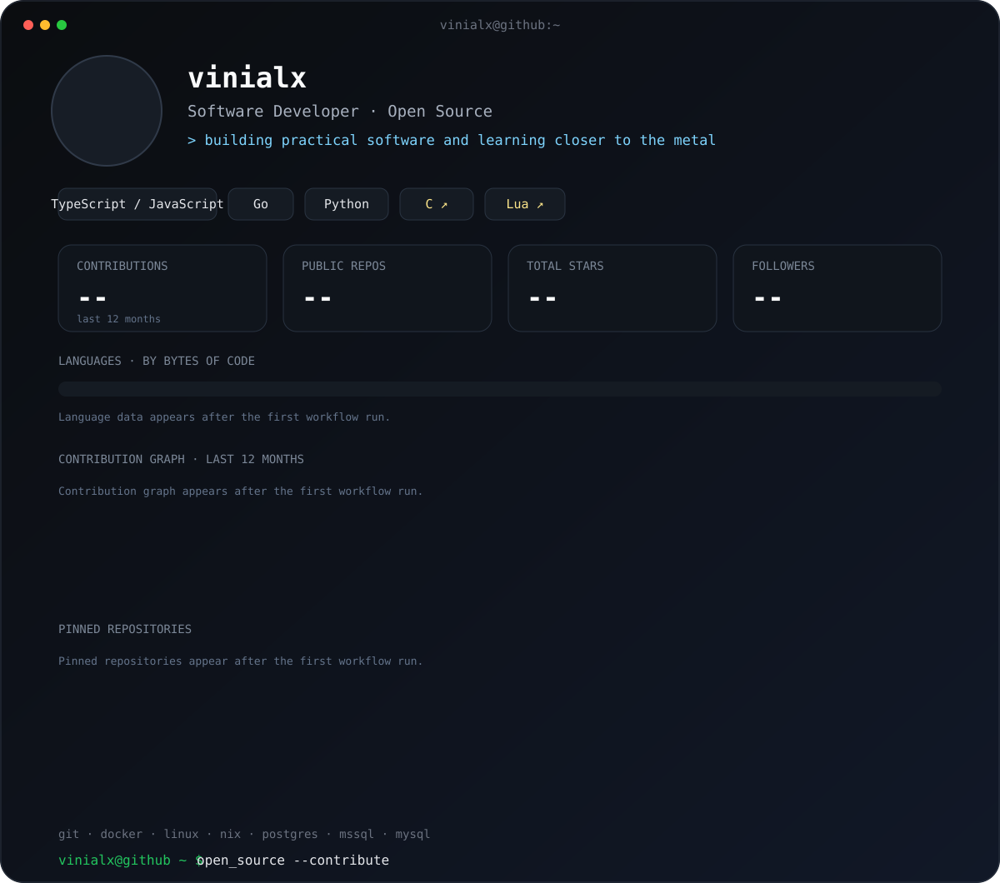

## About

Software developer interested in backend development, developer tooling, Linux and open-source software.

I enjoy building practical tools, experimenting with different ecosystems, and learning closer to the metal.

## Stack

**Languages**

`TypeScript / JavaScript` · `Go` · `Python`

**Currently learning**

`C` · `Lua`

**Tools & Environment**

`Git` · `Docker` · `Linux` · `Nix`

**Databases**

`PostgreSQL` · `Microsoft SQL Server` · `MySQL`

## Open Source

Interested in contributing to open-source projects, especially around developer tools, backend systems, Linux, and infrastructure.

---

Profile card generated automatically with GitHub Actions.
